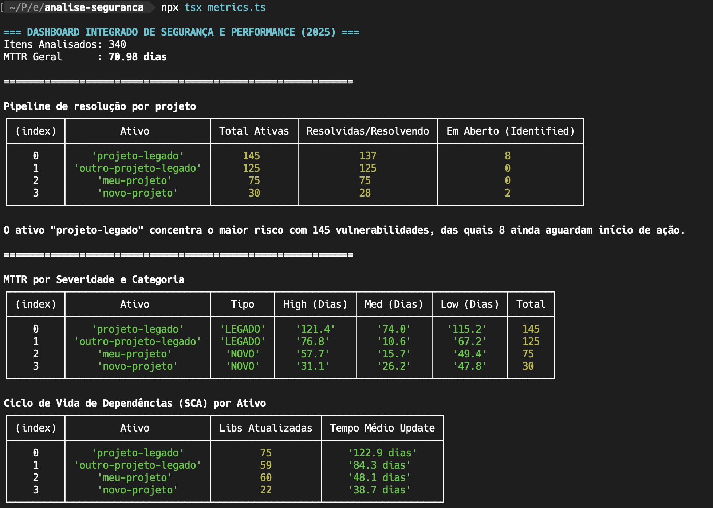

# Análise de Métricas de Segurança

Ferramenta voltada a times de engenharia, AppSec e gestores técnicos para transformar relatórios exportados (.csv) de scanners SAST, SCA e Web em indicadores objetivos de risco, eficiência e maturidade técnica para auxiliar na tomada de decisões e governança.

Implementada em Node.js e TypeScript, o script processa dados de **vulnerabilidades** para extrair KPIs operacionais e de conformidade em ambientes de micro-serviços.



## 🚀 Como Instalar e Rodar

### 1. Pré-requisitos
Certifique-se de ter o [Node.js](https://nodejs.org) instalado (versão 18 ou superior).

### 2. Preparação do Ambiente
Abra o terminal na pasta do projeto e execute:

```bash
# Instalar dependências
npm install
```

### 3. Configuração do .env
Crie um arquivo .env na raiz do projeto e preencha com os dados do seu ambiente:

```bash
CSV_FILE_NAME="seu_arquivo_extraido.csv"
LEGACY_ASSETS="proj-legado-1,outro-legado"
NEW_ASSETS="meu-novo-service,outro-projeto-do-zero"
ANALYSIS_YEAR="2025"
```

### 4. Execução
Para gerar o dashboard de métricas no terminal, rode:

```bash
# Executar script
npx tsx metrics.ts
```

## Estrutura mínima do .CSV

```bash
# colunas obrigatórias para funcionar
interface VulnerabilityRow {
  'Vulnerability ID': string;
  'Name': string;
  'Asset Name': string;
  'Severity': string;
  'Status': string;
  'Created at': string;
  'Updated_at': string;
  'Last Status Change Date': string; 
  'Type': string;
}
```

## Entendendo as Métricas

O script processa os dados excluindo automaticamente os Falsos Positivos para garantir que a análise reflita apenas o risco real.

### MTTR Geral (Mean Time To Remediation)

- O que é: O tempo médio (em dias) que a equipe leva para resolver uma vulnerabilidade real.

- Interpretação: Um MTTR decrescente indica maior agilidade da equipe. A filtragem de falsos positivos nesta métrica é crucial para revelar o tempo de trabalho real da engenharia, sem o "ruído" de triagens rápidas.

### 2. Pipeline de Resolução por Ativo

- Resolvidas/Resolvendo: Soma de itens em fix_accepted e awaiting_validation. Mostra o volume de trabalho entregue ou em fase final.

- Em Aberto (Identified): Itens que ainda não entraram no fluxo de correção.

- Insight: Ideal para identificar gargalos. Se um ativo possui muitas vulnerabilidades mas poucas em "Resolvendo", há um bloqueio de priorização naquele projeto.

### MTTR por Severidade e Categoria

- Visão Estratégica: Separa os ativos entre LEGADO e NOVO.

- Severidade (High/Med/Low): Visa demostrar que a engenharia prioriza riscos críticos. O esperado é que o MTTR de itens HIGH seja menor que o de itens LOW.

### Ciclo de Vida de Dependências (SCA)

- Foco: Atualização de bibliotecas vulneráveis (ex: npm packages).
- Importância: Essencial para auditorias de conformidade (Compliance). Mostra quão rápido a empresa responde a vulnerabilidades de terceiros (Supply Chain Security).
